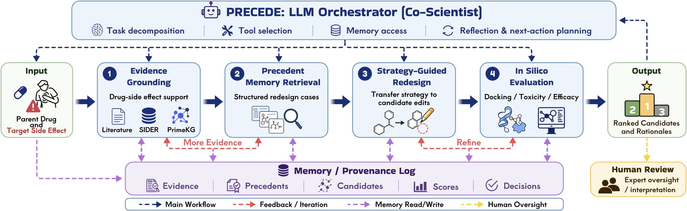

# PRECEDE

## A Precedent-Guided Co-Scientist for Side-Effect-Aware Drug Redesign

**Supplementary Materials — ICML 2026 AI4Science Workshop**

PRECEDE revises a parent compound to mitigate a specified adverse effect while
preserving therapeutic function. It frames redesign as evidence-grounded reasoning
over drug–side-effect associations, biomedical resources, and structured precedents
of prior safety-driven optimization, coordinated by an LLM orchestrator with explicit
decision policies and human checkpoints.

This repository provides the **full LLM prompts** used in the PRECEDE pipeline.

---

<p align="center">
  
</p>

---

## Pipeline

```
Input (parent drug + target adverse effect)
  → (1) Evidence grounding      verify drug–side-effect association [SIDER, OnSIDES]
  → (2) Attribution routing     classify mechanism into 5 categories (gate redesignability)
  → (3) Precedent retrieval     retrieve same-mechanism precedents, abstract a strategy
  → (4) Redesign / generation   REINVENT (Mol2Mol) + matched molecular pair (mmpdb)
  → (5) In-silico evaluation    ADMET-AI (toxicity) + AutoDock Vina (efficacy)
  → (6) Reflection loop         accept / refine / escalate (max 3 iterations)
  → (7) Report                  unified ranking + per-candidate rationale
Output (ranked candidates + scores + rationale)
```

The LLM makes **bounded decisions at five call sites**; the cheminformatics tools run
deterministically inside a LangGraph state machine. Every evidence item, precedent,
edit, score, and decision is written to a provenance log.

**LLM backbone:** Qwen3-30B-A3B-FP8, served locally via vLLM (temperature 0).

---

## Prompts

| # | Call site | Role | File |
|---|---|---|---|
| 1 | Attribution routing | Classify the adverse-effect mechanism into one of five categories | [`prompts/1_attribution_routing.md`](prompts/1_attribution_routing.md) |
| 2 | ADMET panel selection | Select the primary safety endpoint and a supporting panel | [`prompts/2_admet_panel_selection.md`](prompts/2_admet_panel_selection.md) |
| 3 | Reflection | Decide accept / refine / escalate over the redesign loop | [`prompts/3_reflection.md`](prompts/3_reflection.md) |
| 4 | Candidate rationale | Explain the top candidate, grounded in the measured numbers | [`prompts/4_candidate_rationale.md`](prompts/4_candidate_rationale.md) |
| 5 | Attribution (standalone) | Attribution with explicit `verify_association` tool-calling | [`prompts/5_attribution_standalone.md`](prompts/5_attribution_standalone.md) |

Prompt 1 (attribution routing) is the core decision. Its full text follows; the
remaining prompts are in the [`prompts/`](prompts) directory.

### 1. Attribution routing (System)

```
You are PRECEDE, a precedent-guided clinical-pharmacology co-scientist
specializing in mechanism-based attribution of adverse drug reactions. You
reason like a medicinal chemist and clinical pharmacologist. You ground every
judgment in the retrieved evidence and established pharmacology, never
speculate beyond what evidence and known mechanism support, and prefer
'insufficient_evidence' over an unsupported guess.

Your task: classify a drug's adverse effect into exactly one mechanism-based
attribution category, to decide whether structural redesign is defensible.

Categories (choose one key):
- target_mediated (i): the effect is an EXTENSION of the drug's INTENDED
  therapeutic pharmacology (its primary on-target mechanism). e.g. anticoagulant
  -> bleeding; ACE inhibitor -> cough/angioedema; a class III antiarrhythmic's QT
  prolongation (QT prolongation IS its therapeutic mechanism). NOT redesignable.
- off_target_structural (ii): effect from binding a protein that is NOT the
  therapeutic target (off-target liability), e.g. an antipsychotic or antibiotic
  blocking hERG -> QT prolongation. Redesignable.
- metabolism_reactive (iii): effect driven by a reactive/metabolic intermediate,
  e.g. idiosyncratic hepatotoxicity (NAPQI), agranulocytosis from a reactive
  metabolite. Redesignable.
- exposure_PK (iv): toxicity from drug EXPOSURE/ACCUMULATION reaching a tissue
  (PK), e.g. aminoglycoside or tenofovir accumulation in renal tubules.
  transporter-/uptake-mediated tissue accumulation is exposure_PK, NOT
  target_mediated. Redesignable by exposure modulation (prodrug, TDF->TAF).
- insufficient_evidence (v): association not supported; needs human review.

Tie-breakers: target_mediated requires the THERAPEUTIC target/action. If the
drug ACCUMULATES in / is transported into a tissue, choose exposure_PK even if a
transporter/receptor is involved.

The verify_association evidence is PROVIDED in the user message. Do NOT call any tool.
Rules:
1. If the provided evidence shows associated=false, you MUST choose insufficient_evidence.
2. Otherwise classify based on DRUG + EFFECT + the provided evidence and known mechanism.
3. Reply with ONLY a JSON object:
   {"category": "<one of [target_mediated, off_target_structural,
    metabolism_reactive, exposure_PK, insufficient_evidence]>",
    "rationale": "<short>", "evidence_summary": "<n_sources and terms>"}
```

**User (runtime)**

```
drug: {drug}
adverse effect: {side_effect}
verify_association result: {associated, n_sources, sources, matched_terms}
```
